# Answers for the git advanced exercise

## Part 1
### 1. Missing file fix
```
$ git commit --amend -m "create third file"
$ git add test4.md && git commit -m "chore: create fourth file"
```
### 2.Editing Commit History
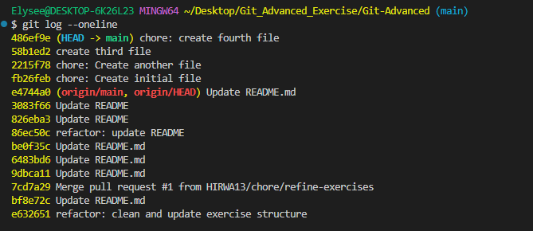

```
$ git rebase -i fb26feb (git rebase -i <commit before the one you want to amend>)

```

```
| Command | Short | Meaning                                               |
| ------- | ----- | ----------------------------------------------------- |
| pick    | p     | Keep commit unchanged                                 |
| reword  | r     | Change commit message                                 |
| edit    | e     | Stop and edit the commit                              |
| squash  | s     | Combine with previous commit                          |
| fixup   | f     | Combine with previous commit and discard this message |
| drop    | d     | Delete commit                                         |
| exec    | x     | Run a shell command                                   |

```

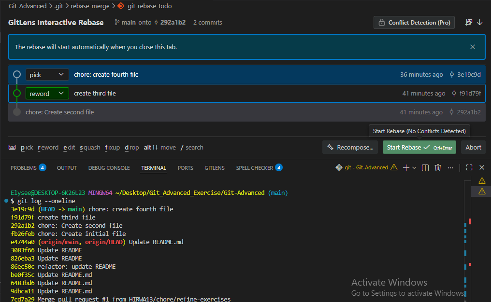

if you click the start rebase button above the rebase starts and a commit edit will open allowing you to modify the commit message and click the commit button. The commit message will be rewritten and saved.

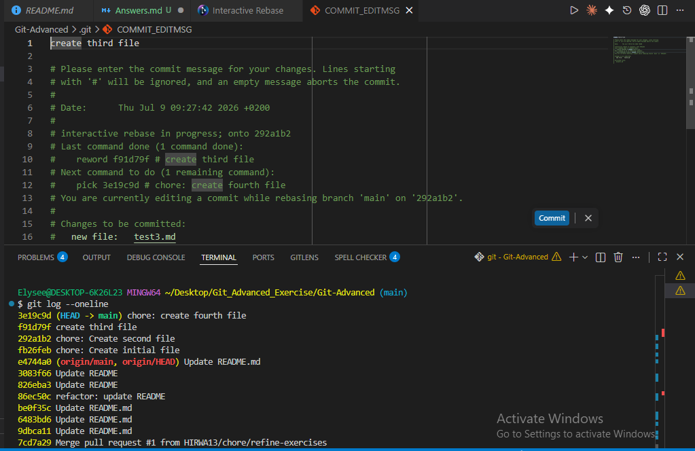
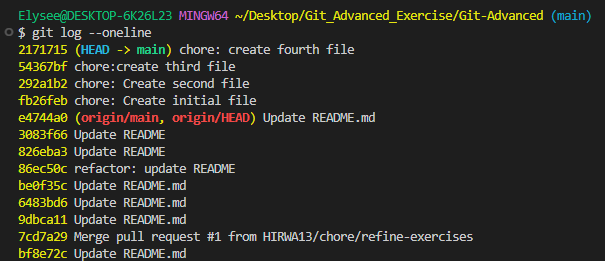

### 3. Squashing Commits.

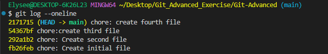

```bash
$ git rebase -i fb26feb
```
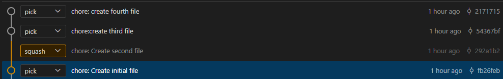


click start rebasing button

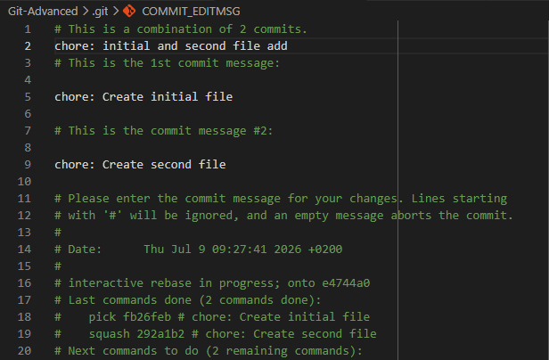


click commit button and changes will be saved.

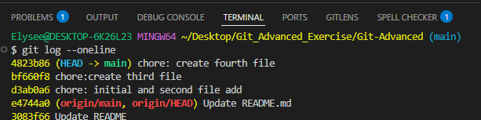

### 4. Splitting a Commit
#### 4.1 Splitting the latest commit

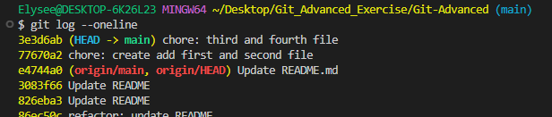


`$ git reset HEAD~` (this command resets the latest commit to the staging area).
Then now you can add and commit each one individually.

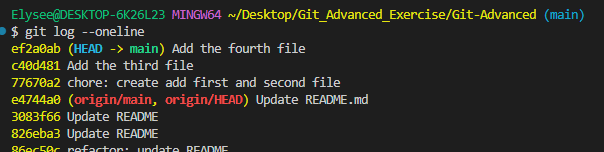

#### 4.2 Splitting a further commit


`git rebase -i e4744a0` (select the commit before the one you want to change)

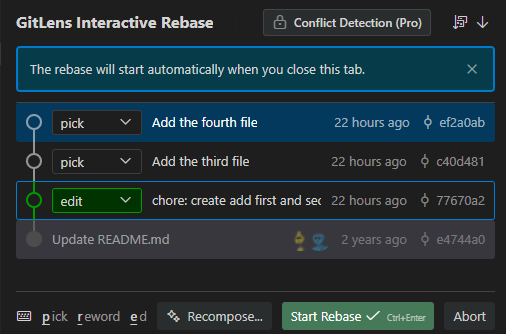


- Click start rebase button

- `git reset HEAD~` : this removes the committed files back to the working directory

- Stage each file separately and commit them separately.

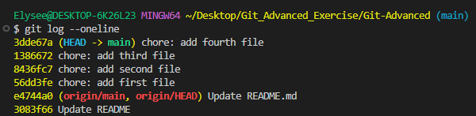

### 5. Advanced Squashing


```
git rebase -i 8436fc7
```
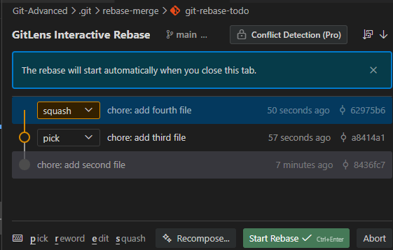

```
click the start rebase button
```

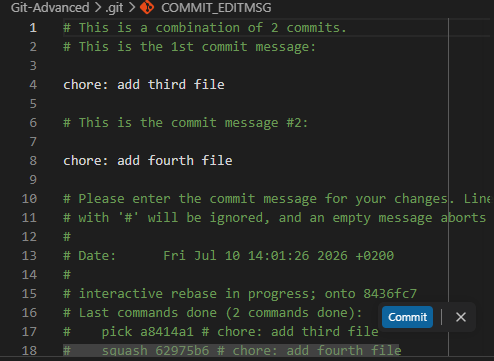

Then:

- Rename the commit message to describe the combined changes from both commits.
- Click **Commit**.
- Click **Continue Rebase** to finish the rebase.

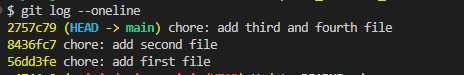

### 6. Dropping a Commit

    - Created an unwanted.txt file
    - Staged it and Committed it.
   
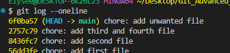

```bash
$ git rebase -i 2757c79
```

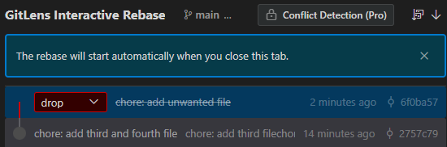

click start rebase button and the commit will be dropped.    


### 7. Reordering Commits

 **Commit history before**
 

 ```bash
 $git rebase -i 56dd3fe
 ```
 Then move the commits according to how you want them.

 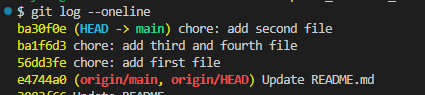

### 8. Cherry-Picking Commits:

- Create a branch ft/branch
```bash
git checkout -b ft/branch
```

- Add new file test5.md
```bash
touch test5.md
```

- Add the file and commit
```bash
git add test5.md && git commit -m "Implemented test 5"
```

- checkout the commit hash by and switch back to main:
```bash
git log --oneline
git checkout main
```

- Use the cherry pick command to bring the commit to your main branch
```bash
git cherry-pick <commit-hash>
```
### 9. Visualizing Commit History

To visualize your commits in form of graph for easy understanding.
```bash
git log --graph
```

### 10. Understanding Reflogs

#### When to Use `git reflog`

Use `git reflog` to recover from situations such as:

- An accidental `git reset --hard`
- A bad `git rebase`
- A mistaken `git commit --amend`
- An unwanted `git cherry-pick`
- A deleted branch (if its commits are still available in the reflog)

```bash
git reflog
```
Select the hash you want to return to

```hash
git reset --hard <commit-hash>
```

## Part 2 Branching Basics

### 1. Feature branch creation:
Creating a new branch and switch to it `ft/new-feature`

```bash
git checkout -b ft/new-feature
```
### 2. Working on the feature branch

```bash
touch feature.txt
git add feature.txt && git commit -m "Implemented core functionality
for new feature"
```
### 3. Switching Back and Making More Changes:

```bash
git switch main
touch readme.txt
git add readme.txt && git commit -m "Updated project readme"
```
### 4. Local vs Remote Branches

#### Local vs. Remote Branches

A **local branch** exists only on your computer and is where you develop and commit your changes.

A **remote branch** is a copy of a branch stored on a remote repository such as GitHub, allowing you to share your work and collaborate with others.

View local branches:

```bash
git branch
```

View remote branches:

```bash
git branch -r
```

Push a local branch to GitHub:

```bash
git push -u origin <branch-name>
```

Download and merge the latest changes from the remote repository:

```bash
git pull
```

Download the latest changes only from the remote repository:

```bash
git fetch
```

Keeping your local and remote branches in sync ensures you always work with the latest version of the project.

### 5. Branch Deletion:

Once you merged into the main it's good practice to delete the branch
```bash
git branch -d ft/new-feature
```

### 6. Creating a Branch from a commit:

- Checkout first the commit hash
```bash
git log --oneline
```
- Create a new branch called ft/new-branch-from-commit
```bash
git checkout -b ft/new-branch-from-commit <commit-hash>
```

### 7. Branch Merging

Once you've finished working on your feature branch, merge it into the `main` branch.

Switch to the `main` branch:

```bash
git switch main
```

Merge the feature branch:

```bash
git merge ft/new-branch-from-commit
```

If merge conflicts occur, resolve them, stage the resolved files with `git add`, and complete the merge:

```bash
git commit
```

Your feature branch is now successfully integrated into `main`.

### 8. Branch Rebasing

Rebasing moves your branch commits on top of the latest commit from another branch, creating a cleaner, linear commit history.

Switch to your feature branch:

```bash
git switch ft/new-branch-from-commit
```

Rebase it onto the `main` branch:

```bash
git rebase main
```

If conflicts occur, resolve them, stage the changes with `git add`, and continue the rebase:

```bash
git rebase --continue
```

 **Note:** Rebasing rewrites commit history. Avoid rebasing branches that have already been shared with others.

### 9.Renaming a Branch

You can rename a branch to give it a more meaningful and descriptive name.

Rename the current branch:

```bash
git branch -m ft/improved-branch-name
```

Or rename a specific branch:

```bash
git branch -m ft/new-branch-from-commit ft/improved-branch-name
```

Verify the renamed branch:

```bash
git branch
```
### 10. Checking Out Detached HEAD

#### Checking Out a Detached HEAD in Git

A detached HEAD occurs when HEAD points directly to a specific commit instead of a branch.

Normally, HEAD points to a branch (e.g., main), and the branch points to the latest commit.

To enter a detached HEAD state, use:

`git checkout <commit-hash>`

or:

`git switch --detach <commit-hash>`

This allows you to view, test, or explore an older commit without affecting your branches.

Example:
`git checkout a1b2c3d`

After this, Git shows that HEAD is detached because it is no longer attached to a branch.

If you create new commits in detached HEAD mode, they may be lost when switching branches.

To save your work, create a new branch:

`git checkout -b <new-branch>` 
or
`git switch -c <new-branch-name>`

Detached HEAD is useful for debugging, testing previous versions, and inspecting commit history.

## Part 3: Advanced Workflows

### 1.Stashing Changes:
To stash your changes 
`git stash`: stashes changes which are being tracked by git
`git stash -u`: stashes both untracked and tracked changes by git.

### 2. Retrieving stashed changes
`git stash pop`: this command retrieves the latest stash to be stashed and removes it in the stored stashes.

`git stash pop <stash-hash>`: this command retrieves the stash you want by specifying it's commit hash

`git stash apply <stash-hash>`: this command retrieves the stash you want by specifying it's hash and doesn't delete it from the stash store


### 3. Branch Merging Conflict
`git checkout -b ft/merge-conflict`: create a new branch
- Add some content in it test1.txt file
`git add test1.md && git commit -m "Added changes to test1 file`: add and commit the changes
`git checkout main` : checkout to main
- Add some changes also in the test1.txt file
`git add test1.md && git commit -m "feat: add changes in test1 file"`: add and commit the changes
`git checkout ft/merge-conflict`: merge the changes and a conflict will occur

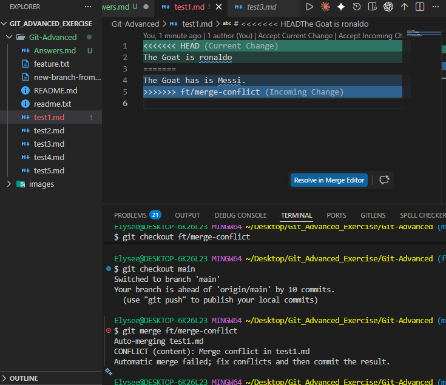

- Solve the conflict manually and a commit will be made indicating the merge of the two branches.


